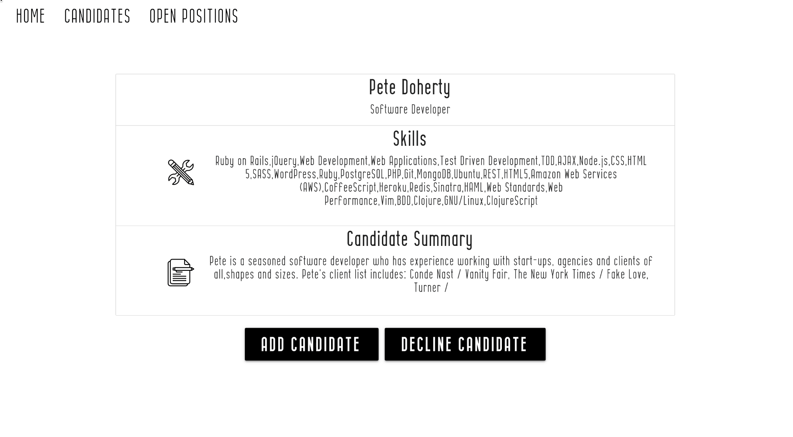
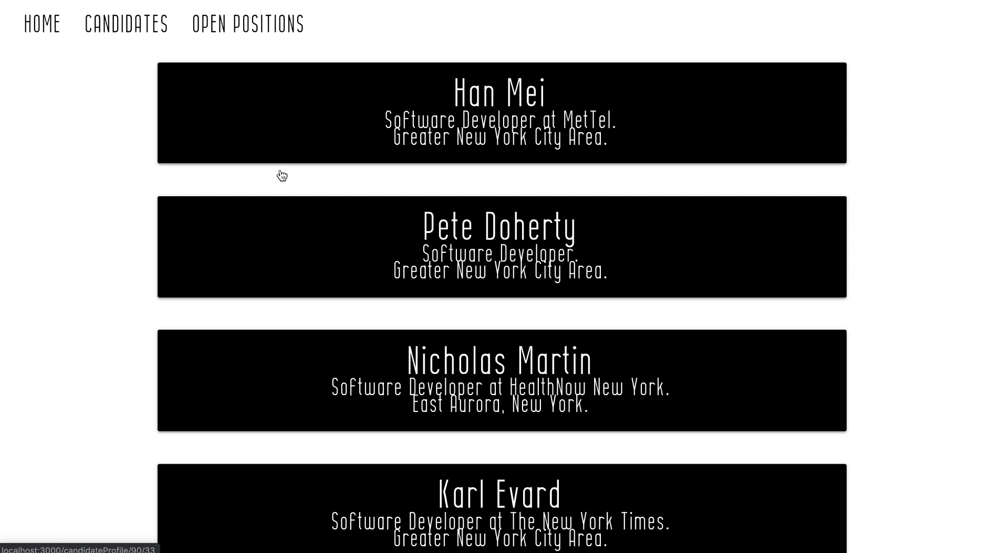
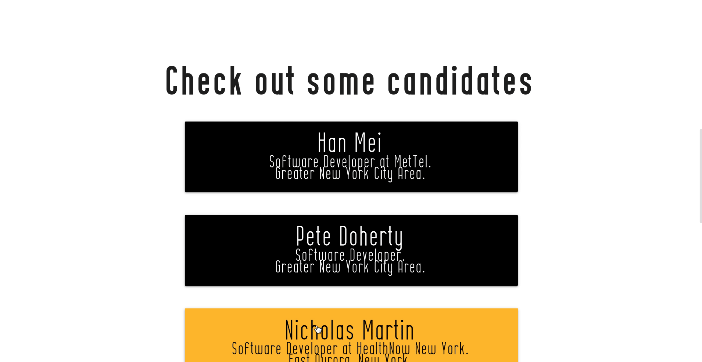
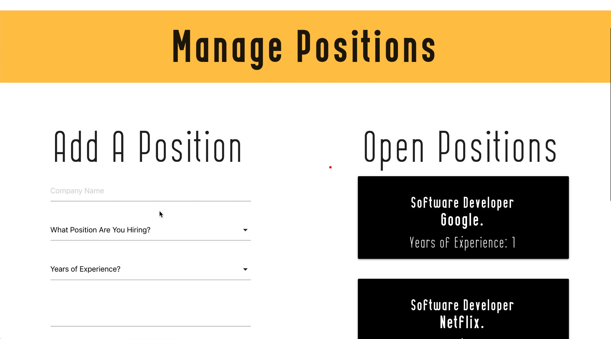

### ***Project under construction***
Hire is a machine learning application that helps companies filter through job applicants, finding candidates that best fit what the company is looking for. Using an artificail nueral network, Hire take the info on candidates the hiring manager/recruiter has accepted or declined and build a model that predicts which candidates fit the criteria. Better than boolean searches, it can handle thousands of features and assign weights rather than yes or no values to provide a more tailored, more accurate result. 

# Technologies/Concepts Used
### Front End: 
- JavaScript
- React/Redux
- Materialize 

### Back End:
- Express/Node
- MySQL

### Web scraping:
- Python
- Selenium 

### Machine Learning:
- Pandas
- numpy
- sklearn  

# Check it out!

